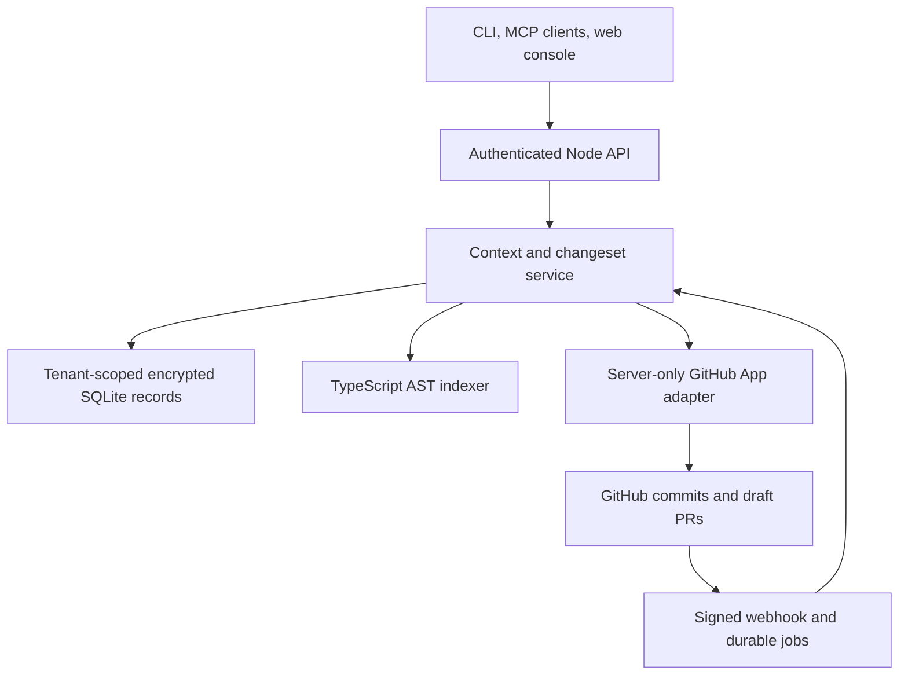

> Update: Cloudflare Workers/D1/R2 is now the requested cloud target. The SQLite decisions below describe the retained local/single-instance adapter. See [Cloudflare deployment and tradeoffs](cloudflare.md) for the implemented cloud adapter.

# Architecture and decisions

Status: executable alpha, 2026-09-06. The product is feasible; reliable dependency recall and secure publication are the hard parts. A attractive graph alone does not address either.

## Implemented architecture

The local CLI also reads existing Git object databases without contacting the service. No repository code is executed during mapping. The cloud adapter downloads eligible blobs from an exact commit tree through the GitHub App. Both feed the same indexer.

## ADR 001: deterministic TypeScript-first extraction

Use the TypeScript compiler API for JS, JSX, TS, and TSX declarations and static relative imports/re-exports/require/dynamic-import string literals. TypeScript is common in agent-assisted applications and its own parser avoids regex parsing of program structure. JSON, SQL, Markdown, YAML, TOML, HTML, and CSS are file nodes, not semantically extracted schemas or contracts yet.

The first engine resolves relative modules including TypeScript sources referenced with `.js` specifiers. It does not yet honor tsconfig paths, package exports, project references, bundler plugins, framework registries, function call targets, runtime reflection, or ORM semantics. Bare imports are external/unknown, not invented internal edges. Unsupported relationships produce explicit uncertainty.

Later extractors emit a common versioned graph contract. Add Python via tree-sitter plus language-aware resolution, then Go and C#. Keep syntactic evidence separate from language-server or build-system resolution. An inference never replaces its source evidence.

## ADR 002: immutable snapshots with incremental reuse

A snapshot is keyed by tenant, repository ID, and exact commit. File objects retain Git blob SHA; declaration reuse is allowed only for unchanged blobs. Imports are resolved again against the new file set, so adding a previously missing file invalidates resolution correctly. Deleted files disappear from the new graph. Tasks continue to use their own base snapshot after synchronization.

The GitHub adapter skips fetching matching cached blobs. The MVP still fetches the recursive tree and scans imports across the snapshot; it is incremental in blob transfer and declaration extraction, not a fully incremental compiler. This avoids incorrect cache reuse before extractor dependency keys exist. Cache keys must eventually include extractor version and compiler/configuration hashes.

Push webhooks are HMAC verified, durably deduplicated, and queued. The single process checks pending jobs every five seconds and retries up to five times. It fetches current branch state rather than trusting webhook source content. The initial connection is synchronous and bounded; background onboarding with per-file progress is a later milestone.

## ADR 003: graph storage and scaling boundary

Use Node 24 and SQLite WAL for a low-cost, single-writer executable MVP. Tenant IDs appear in every record key and lookup. Source-bearing JSON payloads use AES-256-GCM when a data key is configured; production startup requires a key. This is a deliberate single-instance deployment, not a claim of horizontally scalable multi-tenant infrastructure.

At shared-cloud launch, migrate immutable snapshot payloads to KMS-encrypted object storage and entities/edges/tasks/jobs to PostgreSQL with tenant row-level security. Keep composite `(tenant_id, repository_id, revision)` constraints throughout. Adjacency indexes plus bounded recursive queries are sufficient before a dedicated graph database is warranted. A graph database adds operations and cost without proving MVP retrieval quality. Vector retrieval remains optional, subordinate to deterministic structure.

Limits: 5,000 eligible files, 25 MB eligible source, 256 KB/file, 50 edits/changeset, 2 MB HTTP body. Reject truncated GitHub trees. Do not quietly produce a complete-looking partial tree. CPU indexing currently runs in the API process; worker isolation and resource admission are production gates.

## Graph contract

| Record     | Fields and semantics                                                                 |
| ---------- | ------------------------------------------------------------------------------------ |
| Repository | Tenant-scoped ID, GitHub owner/name, branch, installation ID, indexed snapshot       |
| Component  | ID, name, kind, path, subsystem, start/end line, export flag                         |
| Relation   | From, to, kind, textual evidence, confidence, exact revision                         |
| Snapshot   | Revision, sanitized files, nodes, edges, warnings, parsed/reused counters            |
| Task       | Repository ID, immutable base, task description, selected context, omissions         |
| Changeset  | Task ID, immutable base, title, explicit replacements/deletions, lifecycle           |
| Validation | Exact edit/base digest, errors, warnings, impact paths, check statuses               |
| Audit      | Tenant, timestamp, actor, action, opaque target; append-only at application DB layer |

Current component IDs contain path/name/line and are snapshot identities, not stable semantic identities across renames. Future identity matching should store continuity as a separate evidenced relation. `contains` and module links are deterministic; `references` is reserved and not emitted as a guessed call graph. A confidence of 1 means the reported static import resolves, not that runtime behavior is completely known.

## ADR 004: structural context first

Task resolution currently uses lexical scoring over file paths, declared names, and sanitized source. Up to three candidate files seed a two-hop, bidirectional traversal over module/test links. Every selected file or excerpt has a reason. Large files contribute bounded excerpts around matching declarations rather than monopolizing the package. Related components outside the budget remain explicitly omitted.

`find_component`, justified `read_section`, and literal `source_search` provide bounded fallback. There is no unrestricted directory scan/read-all tool. The source-search tool returns at most 20 short matches, and reads permit at most 200 lines/4,000 estimated source tokens. The token estimate is conservative UTF-8 bytes/3; it is not actual model token billing. The serialized package budget includes explanation and omission metadata. Omission lists are capped with a total count; complete impact can be requested through a bounded expansion. A package is evidence, not proof of completeness.

The initial strategy will miss semantic requests with little lexical overlap and over-expand around central modules. Evaluate gold-standard dependent sets before introducing an embedding model or optional external-model task planner. Do not claim token savings from comparing a context package with a whole repository: real agents often read only part of a repo already.

## ADR 005: controlled changesets and draft publication

Edits are explicit replacement contents or deletions. They are immutable once submitted; a revision creates a new changeset ID. No shell expressions or arbitrary repository commands are accepted. Credentials, traversal paths, duplicate edits, and workflow edits are rejected at submission. Validation checks syntax/JSON, unresolved imports introduced by the proposal, and deleted modules with unchanged consumers. It warns about unchanged affected files.

A digest binds validation to the exact base and edit content. Publishing requires publish scope, a passing static validation, and acknowledgment of limitations. The adapter creates blobs, a tree based on the exact base tree, a commit with that base as parent, a unique `caelogram/<changeset-id>` branch, and a draft PR. It never updates the base ref and never merges. Retry recovery checks existing PRs and an existing service branch's tree and parent; it does not overwrite branch collisions.

GitHub REST does not provide an atomic transaction across reading the base head and creating a different branch/PR. We check the base before preparing objects and again immediately before branch creation. A movement after the final check can still occur, but the change always remains on the exact old parent and is never silently rebased onto new code. Required GitHub checks and human review gate merging. If business policy requires rejecting even this final race, add a branch-policy/merge-queue integration; do not claim a cross-ref compare-and-swap primitive that GitHub does not expose.

## ADR 006: no repository execution in the control plane

The current validator never installs dependencies or runs scripts. It therefore cannot assert type correctness, test success, or safe runtime behavior. Draft PRs clearly report tests/typecheck as `not_run`.

The production runner will accept immutable task artifacts through a narrow job API, launch a disposable VM/microVM as an unprivileged user, deny egress by default, mount no App or cloud credentials, enforce CPU/memory/wall-clock quotas, and export bounded sanitized logs and signed results tied to the changeset digest. Validation recipes must be operator-approved rather than taken as commands from repository text. Network dependency installation needs an isolated cache/proxy policy. Containers alone are not the assumed isolation boundary for hostile code.

## ADR 007: functional spatial design

Use custom SVG for the MVP, with a deterministic region layout, real file bodies, directed relationship evidence in the inspector, absolute dependency counts, and semantic symbol detail. SVG supports inspectable DOM and keyboard access at low complexity. There is no particle animation loop or fabricated starfield. The overview does not show invented coverage, churn, health, risk scores, or dead-code certainty.

For much larger maps use aggregated regions and a WebGL renderer behind the same selection model; preserve an accessible table and a truthful visible/total count. Layout should be computed in a worker and cached by snapshot. See the design specification for fixed visual meanings and unimplemented metrics.

## Feasibility and major risks

1. **Recall vs compression:** the decisive benchmark is accepted correct patches with no missed dependents. Excerpts and explicit fallback help, but no parser proves completeness in a dynamic framework.
2. **Agent compliance:** MCP/skills guide behavior; they cannot prevent a separately authorized agent from reading local files or writing GitHub through other tools. Workspace policies and server publication scopes are distinct controls.
3. **Secret detection:** redaction is heuristic and not a guarantee. Production needs an independent scanner, tenant exclusions, fail-closed quarantine, verified no-secret tests, and safe handling of source fragments/logs.
4. **Publication races:** exact-parent branches prevent silent application to moved code; cross-ref race and retries still require CI, idempotency testing, and audit.
5. **Security boundaries:** current app-layer isolation needs independent review and database-enforced defense in depth before shared private-code hosting.
6. **Economics:** reusing blobs avoids redundant downloads. GitHub rate limits, indexing CPU, snapshot retention, and sandbox execution will dominate costs before the simple adjacency store does. No unsubstantiated cost-per-task estimate is offered.
7. **Visual honesty:** architectural importance is not code quality; static incoming imports are not runtime reachability; unknown coverage must stay unknown.
